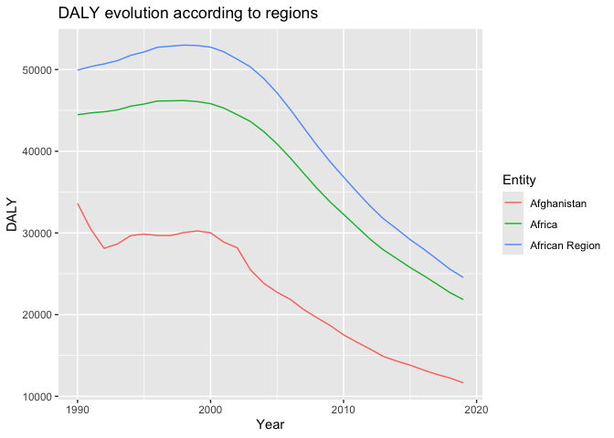

Global Disease Burden Analysis
================
Alisson Charmey

# Introduction

This document compares the Disability-Adjusted Life Year (DALY) diseases
burden for three countries: COUNTRY 1, COUNTRY 2, and COUNTRY 3. We
compare the burden due to communicable, maternal, neonatal, and
nutritional diseases (CMNN), non-communicable diseases (NCDs), and
overall disease burden for these countries.

The source data is from the Institute for Health Metrics and Evaluation
(IHME) Global Burden of Disease (GBD) study.

# Communicable, Maternal, Neonatal, and Nutritional Disease Burden (CMNN)

## Table of Estimates for CMNN Burden Over Time

| Year | Afghanistan |   Africa | African Region |
|-----:|------------:|---------:|---------------:|
| 1990 |    33619.14 | 44466.36 |       49933.05 |
| 1991 |    30453.39 | 44689.87 |       50362.48 |
| 1992 |    28112.19 | 44834.96 |       50691.66 |
| 1993 |    28650.05 | 45057.07 |       51086.85 |
| 1994 |    29673.50 | 45515.60 |       51741.62 |
| 1995 |    29856.81 | 45777.33 |       52154.12 |
| 1996 |    29690.18 | 46146.36 |       52724.78 |
| 1997 |    29678.09 | 46170.26 |       52863.97 |
| 1998 |    30044.35 | 46202.84 |       52993.15 |
| 1999 |    30236.85 | 46078.76 |       52941.85 |
| 2000 |    30014.87 | 45822.68 |       52743.95 |
| 2001 |    28868.53 | 45282.98 |       52174.28 |
| 2002 |    28184.19 | 44478.42 |       51272.61 |
| 2003 |    25480.64 | 43637.93 |       50318.88 |
| 2004 |    23839.24 | 42407.98 |       48905.90 |
| 2005 |    22735.86 | 40892.36 |       47145.57 |
| 2006 |    21860.23 | 39173.34 |       45113.16 |
| 2007 |    20615.41 | 37306.22 |       42896.08 |
| 2008 |    19625.52 | 35463.81 |       40718.47 |
| 2009 |    18656.01 | 33776.65 |       38696.56 |
| 2010 |    17518.71 | 32275.82 |       36846.08 |
| 2011 |    16626.51 | 30754.04 |       35032.26 |
| 2012 |    15777.74 | 29228.58 |       33287.90 |
| 2013 |    14872.69 | 27919.98 |       31731.78 |
| 2014 |    14306.13 | 26854.96 |       30486.12 |
| 2015 |    13815.73 | 25768.92 |       29185.15 |
| 2016 |    13219.40 | 24794.70 |       28045.36 |
| 2017 |    12683.09 | 23755.26 |       26810.53 |
| 2018 |    12237.42 | 22688.66 |       25554.20 |
| 2019 |    11651.19 | 21838.46 |       24555.10 |

## Plot Showing Trends in CMNN Burden Over Time

<!-- -->

## Summary of CMNN Burden Findings

Provide a brief analysis based on the data presented in the table and
chart. Highlight any significant findings or patterns. About 3
sentences.

As we can see, in these 3 regions, we see an increase of the DALY values
between 1990-2000. From 2000, we observe an improvement of the disease
care that reduce the burden of them, with continuous reduction of the
DALY. We can also observe that both Africa and Africa regions have high
DALY compare to Afghanistan. Indeed, we now that disease burden in
Africa is higher than developped countries because of the lack of
follow-up, the lack of help and treatment availibility.

# Non-Communicable Disease Burden (NCD)

## Table of Estimates for NCD Burden Over Time

## Plot Showing Trends in NCD Burden Over Time

## Summary of NCD Burden Findings

Provide a brief analysis based on the data presented in the table and
chart. Highlight any significant findings or patterns. About 3
sentences.

# Overall Disease Burden

## Table of Estimates for Overall Disease Burden Over Time

## Plot Showing Trends in Overall Disease Burden Over Time

## Summary of Overall Disease Burden Findings

Provide a brief analysis based on the data presented in the table and
chart. Highlight any significant findings or patterns. About 3
sentences.
